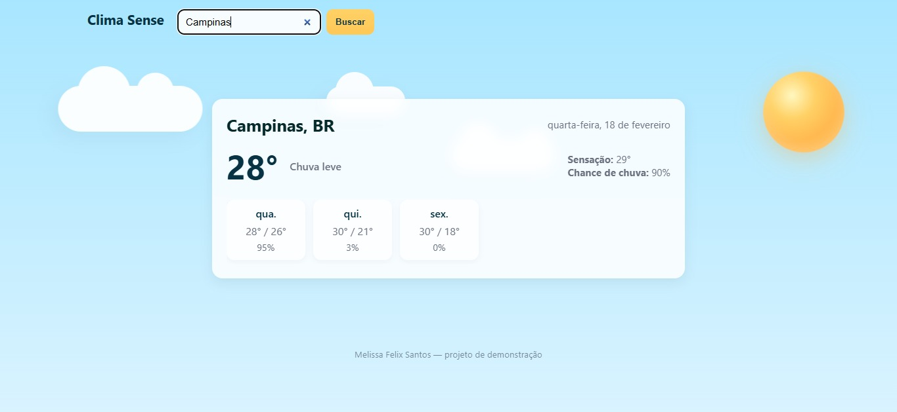

# ☀️ Clima Sense


Aplicação web moderna e responsiva para consultar o clima atual e a previsão dos próximos 3 dias de qualquer cidade do mundo, utilizando dados da API OpenWeatherMap.

---

## 📋 Sobre o Projeto

**Clima Sense** é uma aplicação web que permite visualizar o clima atual e a previsão dos próximos 3 dias de qualquer cidade do mundo.
Com uma interface limpa e intuitiva, o usuário pode buscar informações meteorológicas de forma rápida e fácil.
Este projeto foi desenvolvido com fins de aprendizado, para aprofundar meus conhecimentos em desenvolvimento web e praticar:

- Consumo de APIs REST
- JavaScript assíncrono (async/await)
- Manipulação do DOM
- Tratamento de erros
- Responsividade com CSS

---

## 🎯 Funcionalidades

- 🌡️ Temperatura atual
- 😌 Sensação térmica
- 🌧️ Chance de chuva
- 📅 Previsão dos próximos 3 dias (mínima, máxima e probabilidade de chuva)

---

## 🛠️ Tecnologias Utilizadas

- **HTML5** — Estrutura da aplicação
- **CSS3** — Estilização responsiva
- **JavaScript (ES6+)** — Lógica da aplicação
- **Fetch API** — Requisições HTTP
- **OpenWeatherMap API** — Dados meteorológicos em tempo real

---

## ⚙️ Como Executar o Projeto

### ✅ Pré-requisitos

- Python 3.6 ou superior
- Chave de API gratuita da OpenWeatherMap
- Git (opcional)

---

### 🔑 1. Obter a Chave de API

1. Acesse: https://openweathermap.org/api  
2. Clique em **My API Keys**
3. Gere uma nova chave
4. Aguarde de 10 a 15 minutos para ativação

---

### 📥 2. Clonar o Repositório

```bash
git clone https://github.com/melissafelixx/Clima-Sense.git
cd climasense
```

---

### 🔧 3. Configurar a API Key

Abra o arquivo `app.js` e localize:

```javascript
const API_KEY = 'sua_chave_aqui';
```

Substitua pela sua chave gerada no site da OpenWeatherMap.

---

### ▶️ 4. Rodar o Servidor Local

No terminal, dentro da pasta do projeto, execute:

```bash
python -m http.server 8000
```

Se preferir usar outra porta:

```bash
python -m http.server 3000
```

---

### 🌐 5. Acessar o Aplicativo

Abra o navegador e digite:

```
http://localhost:8000
```

A aplicação deverá carregar normalmente 🎉

---

## 🔄 Como o Projeto Funciona

### Fluxo da Aplicação

1. Usuário digita o nome da cidade
2. A aplicação chama a API de Geocoding
3. Obtém latitude e longitude
4. Consulta a API de previsão do tempo
5. Processa os dados recebidos
6. Renderiza as informações na tela

---

## 🎓 Aprendizados

Este projeto permite praticar:

- Consumo de APIs REST
- Requisições HTTP com Fetch API
- JavaScript assíncrono
- Manipulação do DOM
- Estruturação de projetos web
- Tratamento de erros
- Responsividade

---

## 👩‍💻 Autora

Melissa Felix Santos  

